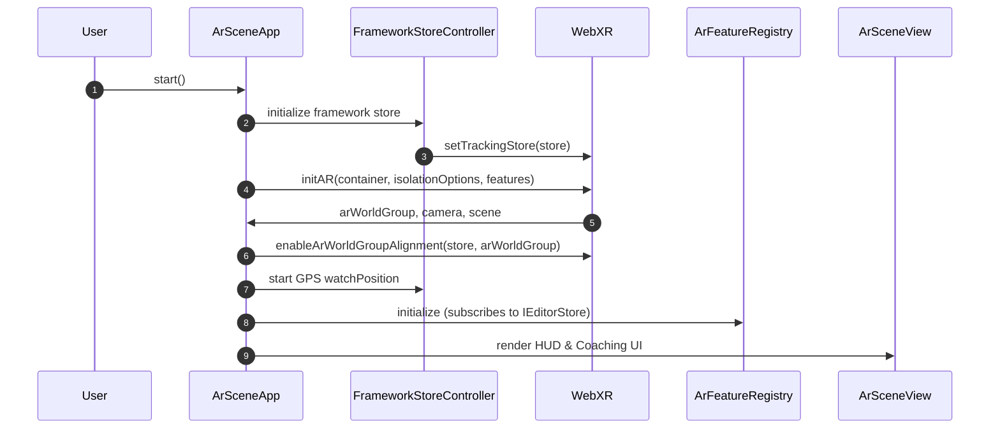
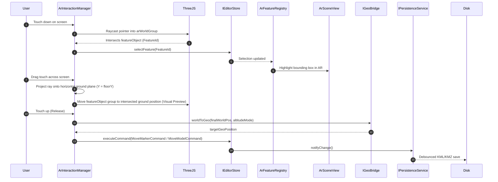

# AR Viewing and Editing Scene — Implementation Plan

## Overview

The `ar-scene` component is the final integration layer (Component 9) of the project. It integrates the core KML/KMZ engine, coordinate bridge, and feature renderers into a location-based mobile WebXR experience. It runs on a mobile device (typically Android Chrome) or in a desktop replay environment, positioning KML features (markers, lines, overlays, and COLLADA models) in the real physical world based on live GPS and device pose data.

This component is strictly view-layer and orchestration-layer. It integrates the `gps-plus-slam-app-framework` for SLAM + GPS tracking with our `IEditorStore` and `IPersistenceService` to support viewing, selection, and mobile editing (such as grab-to-move) of geolocated features.

### Boundaries

**It owns:**
- WebXR session initialization, lifecycle, and termination (`initAR`, `endARSession`, custom frame updates).
- Instantiating and managing the framework's tracking store (`SlamAppStore`) and setting up tracking/pose subscribers.
- Geolocated anchoring of Three.js objects by creating and updating `GpsAnchor` instances for each feature.
- Listening to the shared `IEditorStore` to dynamically create, reconcile, and delete 3D representations inside the AR world coordinate group (`arWorldGroup`).
- WebXR DOM overlay mounting, status message HUDs, and onboarding coaching layouts.
- Mobile AR gestures: screen-space tap raycasting for feature selection, and screen-space dragging (grab-to-move) mapped to world-space horizontal planes.
- Dispatching spatial commands (e.g., `MoveMarkerCommand`) to the `IEditorStore` upon gesture completion.
- Replaying task recordings on desktop for automated E2E validation.

**It never owns:**
- KML parsing, XML tree mutation, or KMZ archive writes (`kmz-io`, `kml-model`).
- Mathematical conversion between geographic coordinates and local Cartesian coordinates (`geo-bridge`).
- The internal geometry, materials, or shaders of individual feature renderers (`renderers`).
- The command undo/redo history stack, command validation, or property panel UI (`commands`).
- Writing/flushing bytes to disk, file permission re-authentication, or file download generation (`persistence`).
- Implementing raw VIO tracking, sensor loop collection, or GPS zero-reference estimation (`gps-plus-slam-app-framework`).

### Contracts Consumed

- `IEditorStore` and `EditorState` from [contracts/store.ts](file:///c:/Users/King/Documents/location-based-webxr/KmlEditor/src/contracts/store.ts).
- `IKmlDocument`, `IFeatureView`, and feature sub-types from [contracts/document-model.ts](file:///c:/Users/King/Documents/location-based-webxr/KmlEditor/src/contracts/document-model.ts).
- `IAssetProvider` from [contracts/kmz-container.ts](file:///c:/Users/King/Documents/location-based-webxr/KmlEditor/src/contracts/kmz-container.ts).
- `IRendererFactory` and `IFeatureRenderer` from [contracts/renderer.ts](file:///c:/Users/King/Documents/location-based-webxr/KmlEditor/src/contracts/renderer.ts).
- `ICommand` from [contracts/commands.ts](file:///c:/Users/King/Documents/location-based-webxr/KmlEditor/src/contracts/commands.ts).
- `IPersistenceService` from [contracts/persistence.ts](file:///c:/Users/King/Documents/location-based-webxr/KmlEditor/src/contracts/persistence.ts).
- `FeatureId`, `GeoPosition`, `WorldPosition`, and `LatLonBox` from [contracts/type.ts](file:///c:/Users/King/Documents/location-based-webxr/KmlEditor/src/contracts/type.ts).

---

## Internal Architecture

To enforce clean separation of concerns, browser-specific WebXR APIs are kept at the boundary. The business logic (reconciliation, gesture translations, store wiring) is managed via pure controllers.

```text
ArSceneApp (Orchestrator & Composition Root)
 ├─ FrameworkStoreController (Manages SlamAppStore and GPS updates)
 ├─ ArSceneView (DOM overlay, WebXR canvas container, HUD, and coaching UI)
 ├─ ArFeatureRegistry (Syncs IEditorStore state ↔ Three.js Objects + GpsAnchors)
 └─ ArInteractionManager (WebXR screen raycasting, selection, grab-to-move controller)

Shared Components:
 ├─ IEditorStore (Editor state, document, and commands)
 ├─ IPersistenceService (Triggers debounced auto-save)
 └─ gps-plus-slam-app-framework (VIO + GPS fusion alignment engine)
```

### 1. `ar-scene-app.ts` — `ArSceneApp`
- **Responsibility:** Composition root that initializes the WebXR session, mounts the UI views, sets up the framework store, and manages startup and disposal lifecycles.
- **Inputs:** DOM host container, instances of `IEditorStore` and `IPersistenceService`, and optional device configuration options.
- **Outputs:** Mounted canvas and UI; methods to start/stop the AR session (`start()`, `stop()`).
- **Dependencies:** Framework `initAR`, `endARSession`, and local controllers.
- **Invariants:** 
  - There is at most one active WebXR session.
  - Calling `start()` while a session is active throws an error.
  - Disposing `ArSceneApp` stops the frame loop, ends the WebXR session, disposes all local sub-modules, and unsubscribes from both store instances.

### 2. `framework-store-controller.ts` — `FrameworkStoreController`
- **Responsibility:** Configures and wraps the framework's `SlamAppStore`. It wires geolocation position events from the browser's Geolocation API into the framework store.
- **Inputs:** Geolocation updates (`GeolocationPosition` objects) from the device GPS.
- **Outputs:** Updated framework store state containing VIO poses, GPS reference, and alignment matrices.
- **Dependencies:** `createSlamAppStore`, `setTrackingStore`, `recordGpsEvent` from the framework.
- **Invariants:** 
  - All GPS position events are filtered for valid accuracy before dispatching to the framework store.
  - Subscribes to Geolocation API only when the WebXR session is active.

### 3. `ar-feature-registry.ts` — `ArFeatureRegistry`
- **Responsibility:** Listens to the `IEditorStore` and synchronizes the scene graph. It creates, updates, and deletes `THREE.Object3D` representations inside `arWorldGroup` and pairs them with `GpsAnchor` instances.
- **Inputs:** `featuresById` and `selectedFeatureId` from `IEditorStore`.
- **Outputs:** Synchronized Three.js objects inside the AR group, and a mapping of `FeatureId` to active `GpsAnchor` instances.
- **Dependencies:** `createGpsAnchor`, `IRendererFactory` from the renderer component.
- **Invariants:** 
  - Each active KML feature has exactly one `IFeatureRenderer` instance and one `GpsAnchor`.
  - When a feature is removed from the store, its `GpsAnchor` is disposed, and its `Object3D` is removed from `arWorldGroup`.
  - Feature coordinate edits in `IEditorStore` update the respective `GpsAnchor`'s target GPS point via `setGpsPoint(gpsPoint)`.

### 4. `ar-interaction-manager.ts` — `ArInteractionManager`
- **Responsibility:** Detects pointer touches on the WebXR screen overlay, performs Raycasting, selects features, and translates mobile touch-drags into grab-to-move actions on the horizontal ground plane.
- **Inputs:** Pointer down/move/up events from the WebXR DOM overlay.
- **Outputs:** Selection updates and spatial commands dispatched to the `IEditorStore`.
- **Dependencies:** `IEditorStore`, Three.js `Raycaster`.
- **Invariants:** 
  - Gestures only modify local visual previews.
  - A command is dispatched to `IEditorStore` exactly once upon pointer release.
  - Dragging coordinates are constrained to a horizontal plane to prevent vertical drift.

---

## Runtime Data Flow

### 1. Initializing and Starting the AR Session


### 2. Rendering and Reconciling KML Features
1. When `IEditorStore` emits a state change, `ArFeatureRegistry` receives the latest list of features.
2. For each feature, the registry checks if a corresponding `THREE.Object3D` and `GpsAnchor` exist:
   - **Create:** Instantiates the renderer via `RendererFactory`, adds the object to `arWorldGroup`, and instantiates a `GpsAnchor` referencing the object, camera, and the feature's geo coordinates.
   - **Update:** If the coordinates have modified in the store (e.g. from an undo/redo action), calls `gpsAnchor.setGpsPoint(newCoordinates)`.
   - **Delete:** Disposes the `GpsAnchor`, removes the object from `arWorldGroup`, and disposes the renderer.

### 3. Selection and Grab-to-Move


---

## Public Surface

No contracts are redesigned. The public surface consists of mounting and control APIs.

### 1. `mount-ar.ts`
Exposes the entry point for mounting the AR component onto a DOM container:
```typescript
export interface ArSceneConfig {
  readonly container: HTMLElement;
  readonly editorStore: IEditorStore;
  readonly persistence: IPersistenceService;
  readonly secondsToAccumulateGps?: number;
  readonly skipBootstrap?: boolean;
}

export interface ArSceneController {
  /** Request starting the WebXR session and rendering loop. */
  start(): Promise<void>;
  /** End the active WebXR session and clean up all DOM/WebGL allocations. */
  stop(): Promise<void>;
  /** Unsubscribe from store listeners and release all resources. */
  dispose(): void;
}

export function mountArScene(config: ArSceneConfig): ArSceneController;
```

---

## Algorithms

### 1. Line Feature Anchoring
Unlike point-based markers and models, KML line features have multiple coordinates forming a path.
- **Reference Anchor:** Compute the geographic bounding center (average latitude and longitude) of all coordinates in the line.
- **Placement:** Create a single `GpsAnchor` parent group positioned at this reference center.
- **Vertex Translation:** Transform all coordinate points of the line into local meter coordinates relative to the reference center using `geoBridge.geoToWorld`. 
- **Geometry Generation:** Construct the Three.js line geometry using these local offsets. This preserves the absolute shape of the line while ensuring it moves stably as a single aligned unit.

### 2. Grab-to-Move Ground Raycasting
To translate screen touch-drags into stable geolocated translations:
1. **Ray Setup:** When the drag starts, construct a virtual horizontal plane in world space at the object's current altitude `Y`.
2. **Intersection:** For each frame update, cast a ray from the camera through the touch coordinates. Find the intersection point `P(x, y, z)` on the virtual horizontal plane.
3. **Validation:** Assert that all values of `P` are finite. Reject intersections if the angle between the ray and the plane is less than 5 degrees (to prevent coordinate blowout at the horizon).
4. **Geo Unprojection:** Call `geoBridge.worldToGeo` on `P` to compute the target latitude and longitude.

---

## State Management

| State | Owner | Lifetime | Synchronization Policy |
|---|---|---|---|
| `arWorldGroup` | WebXR Session | Session | Matrix updated smoothly by `enableArWorldGroupAlignment` based on the framework store's alignment matrix. |
| `activeAnchors` | `ArFeatureRegistry` | Lifecycle of KML Feature | Disposed and recreated during store feature list reconciliation. |
| `selectionHighlight` | `ArFeatureRegistry` | Selection Lifecycle | Bounding box outline shown only when `selectedFeatureId` in the store is non-null. |
| `currentDragPosition` | `ArInteractionManager` | Active Drag Gesture | Re-calculated every frame during a touch drag; reset to null on release. |

### Resource Disposal Policy
All Three.js geometries, materials, and textures loaded by individual feature renderers must be explicitly disposed. On session teardown:
1. Disconnect the store subscriptions.
2. Loop through `ArFeatureRegistry` and call `.dispose()` on every `GpsAnchor` and renderer.
3. Empty `arWorldGroup` and remove it from the Three.js scene.
4. Clear the canvas from the DOM container.

---

## Error Strategy

- **WebXR Not Supported:** Detect `navigator.xr` availability. If absent, degrade by hiding the AR action triggers and displaying a friendly browser upgrade banner.
- **GPS Fix Unavailable:** If the phone reports no GPS position or the accuracy is worse than 15 meters, pause the `GpsAnchor` bootstrap phase, display a "Waiting for accurate GPS..." coaching overlay, and block edits until accuracy stabilizes.
- **Tracking Lost:** Listen to the framework's tracking loss callback. Show a prominent "Tracking Lost: Point your phone at the ground to align" overlay. Keep existing feature models in place but disable selections and drags until tracking is recovered.
- **COLLADA Load Failure:** If `ColladaLoader` fails to load a DAE file, catch the error, write a warning to the HUD console, and instantiate a standard bounding box placeholder mesh (3x3x3 meters) at the model's target coordinates. This ensures the model remains selectable, movable, and preserves the lossless KML round-trip.

---

## Performance Strategy

- **Frustum Culling:** Use Three.js frustum culling on all placemark sprites and COLLADA models. Do not run heavy matrix updates on objects that are behind the camera.
- **GPS Event Throttling:** Throttle raw Geolocation API callbacks to 1 Hz. The SLAM framework performs high-frequency pose interpolation, so feeding GPS data faster than 1 Hz only wastes CPU cycles and battery.
- **Mesh Instancing:** For line vertex handles and markers, share the same underlying sphere geometry and billboard material to minimize draw calls.
- **GC Allocation Prevention:** Reuse vectors (`THREE.Vector3`, `THREE.Matrix4`) inside frame loops instead of instantiating new objects in the tick callback.

---

## Testing Strategy

### 1. Unit Tests
- **Gesture Translation:** Mock a camera and a horizontal plane. Verify that screen pointer positions unproject to the expected world coordinate values.
- **Reconciliation Engine:** Feed mock changes to `IEditorStore` (add, update, delete features). Verify that the `ArFeatureRegistry` calls create, update, and dispose on `GpsAnchor` instances correctly.
- **Altitude Policy:** Verify that `clampToGround`, `relativeToGround`, and `absolute` settings place local `Object3D` Y-positions at the correct vertical offset.

### 2. Replay Integration Tests (Phone-Free)
To ensure regression protection:
- Feed outdoor test recordings (GPS events + VIO poses stored in `fixtures/recordings/`) into the framework store.
- Verify that the alignment matrix converges and positions features at the correct world space coordinates on a simulated desktop.
- Re-run the core E2E round-trip tests: load, edit a marker via simulated AR drag, save, and reload. Assert that the edited KML file remains structurally valid and byte-faithful for untouched elements.

---

## Demo

The `ar-scene` component includes a standalone demo in `demos/ar-scene-demo/`:
- **HTML Container:** A full-screen page that starts a WebXR session when opened on a mobile phone.
- **Mock Controls (Desktop Fallback):** When opened on a desktop browser (where WebXR is unavailable), displays a split-screen view:
  - Left panel: Slider controls to simulate GPS accuracy, latitude/longitude drift, and heading compass values.
  - Right panel: A 3D orbital view showing the camera, the reference origin, and the KML features.
- **Mock File Pickers:** Allows loading a KMZ file from local storage, viewing it in the AR scene, dragging objects, and exporting the modified KMZ file.

---

## Dependencies

- `three`: Reused from rendering components.
- `gps-plus-slam-app-framework`: Core SLAM/GPS fusion tracking framework library.
- `@reduxjs/toolkit`: State slice management.

---

## Risks and Mitigation

| Risk | Severity | Detection | Mitigation |
|---|---|---|---|
| **COLLADA Loader Crash** | High | App crash or freeze when parsing complex DAE geometries. | Sandbox the loader. Wrap `ColladaLoader.load` in a try-catch. If it fails, fall back to rendering a bounding box placeholder. |
| **Severe GPS Drift** | Medium | Anchors visibly jumping or sliding across the screen. | Implement the distance-scaled threshold gate (`snap-when-offscreen` mode). Only snap the anchor when the alignment stabilizes or the object is out of the camera's field of view. |
| **Browser Execution Policy** | Medium | Geolocation or WebXR permissions denied by the browser. | Prompt the user explicitly on initial page load with a diagnostic checklist before requesting the WebXR session. |

---

## Milestones

### Milestone 1: WebXR Bootstrap and UI Mount
- Initialize `initAR` and mount the WebGL canvas inside the DOM container.
- Implement the DOM overlay HUD, coaching panels, and tracking status views.
- **Deliverable:** A blank AR session that cleanly starts, displays camera feedback, and tears down without memory leaks.

### Milestone 2: Feature Rendering and Anchoring
- Implement `ArFeatureRegistry`.
- Wire `IEditorStore` subscriptions to render KML markers and lines inside the AR scene.
- Instantiate `GpsAnchor` for each feature, wired to the framework store's zero reference and alignment matrix.
- **Deliverable:** Live KML markers and lines rendered at their correct GPS positions in the AR scene.

### Milestone 3: Selection and Grab-to-Move Gestures
- Implement raycast picking on screen touch.
- Implement the grab-to-move gesture on the ground plane.
- Construct and dispatch `MoveMarkerCommand` to the store on touch release.
- **Deliverable:** Objects can be selected and moved in AR, with changes synced back to the KML document structure.

### Milestone 4: Models and Auto-Save Integration
- Integrate `ColladaLoader` for 3D DAE models.
- Wire the persistence service to automatically auto-save changes back to the disk handle when editing.
- Add desktop replay end-to-end tests using JSON recordings.
- **Deliverable:** Complete feature-complete AR editor with auto-save persistence and fully green E2E test coverage.
